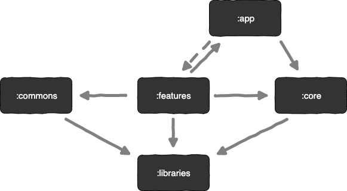

<p align="center">
  <a href="https://github.com/AnasElshawaf0/Naming-Convention">
    
  </a>
</p>

# Guideline naming convention and code style

- [Naming convention](#naming-convention)
- [S-I-D](#s-i-d)
- [Avoid contractions](#avoid-contractions)
- [Avoid context duplication](#avoid-context-duplication)
- [Reflect the expected result](#reflect-the-expected-result)
- [Naming functions](#naming-functions)
    - [A/HC/LC pattern](#ahclc-pattern)
        - [Actions](#actions)
        - [Prefixes](#prefixes)
- [Singular and Plurals](#singular-and-plurals)
- [Classes & Layouts](#classes--layouts)
- [Layout resource IDs](#layout-resource-ids)
- [Drawables](#drawables)
- [Icons](#icons)
- [Strings](#strings)
- [Constants](#constants)
- [Acronyms](#acronyms)
- [XML style rules](#xML-style-rules)
    - [How to access views](#how-to-access-views)
    - [Strings](#strings)
    - [Styles and Themes](#styles-and-themes)
    - [Attributes ordering](#attributes-ordering)
- [Code Style](#code-style)
    - [Order import statements](#order-import-statements)
    - [Logging guidelines](#logging-guidelines)
    - [Class member ordering](#Class-member-ordering)
    - [Parameter ordering in methods](#parameter-ordering-in-methods)
    - [Modularization](#modularization)
        - [App module](#app-module)
        - [Core module](#core-module)
        - [Features modules](#features-modules)
        - [Commons modules](#commons-modules)
        - [Libraries modules](#libraries-modules)
    - [Architecture components](#architecture-components)
    - [Build variants](#Build-variants)

---

Naming things is hard. This sheet attempts to make it easier.

## Naming convention

There are several techniques you can use to make them more readable:

### Camel Case

Each word, except the first, starts with a capital letter:

```js
myVariableName = "John"
```

### Pascal Case

Each word starts with a capital letter:

```js
MyVariableName = "John"
```

### Snake Case

Each word is separated by an underscore character:

```js
my_variable_name = "John"
```

Tips:

* Lower camelCase is used for methods, local variables, and instance variables.
* Constants should be ALL_CAPS.
* Don't start variables with o_, obj_, m_ etc. A variable does not need tags which states it is a
  variable

```js
/* Bad */
var primerNombre = 'Gustavo'
var amigos = ['Kate', 'John']

/* Good */
var firstName = 'Gustavo'
var friends = ['Kate', 'John']
```

```js
/* Bad */
var page_count = 5
var shouldUpdate = true

/* Good */
var pageCount = 5
var shouldUpdate = true

/* Good as well */
var page_count = 5
var should_update = true
```

### S-I-D

A name must be _short_, _intuitive_ and _descriptive_:

- **Short**. A name must not take long to type and, therefore, remember;
- **Intuitive**. A name must read naturally, as close to the common speech as possible;
- **Descriptive**. A name must reflect what it does/possesses in the most efficient way.

```js
/* Bad */
const a = 5 // "a" could mean anything
const isPaginatable = a > 10 // "Paginatable" sounds extremely unnatural
const shouldPaginatize = a > 10 // Made up verbs are so much fun!

/* Good */
const postCount = 5
const hasPagination = postCount > 10
const shouldPaginate = postCount > 10 // alternatively
```

### Avoid contractions

Do **not** use contractions. They contribute to nothing but decreased readability of the code.
Finding a short, descriptive name may be hard, but contraction is not an excuse for not doing so.

```js
/* Bad */
fun onItmClk = () => {}

/* Good */
fun onItemClick = () => {}
```

### Avoid context duplication

A name should not duplicate the context in which it is defined. Always remove the context from a
name if that doesn't decrease its readability.

```js
class MenuItem {
  /* Method name duplicates the context (which is "MenuItem") */
  handleMenuItemClick = (event) => { ... }

  /* Reads nicely as `MenuItem.handleClick()` */
  handleClick = (event) => { ... }
}
```

### Reflect the expected result

A name should reflect the expected result.

```jsx
/* Bad */
var isDisabled = itemCount <= 3
return Button.isEnabled=!isDisabled
 />

/* Good */
var isEnabled = itemCount > 3
return Button.isEnabled=isEnabled
 />
```

---

# Naming functions

## A/HC/LC Pattern

There is a useful pattern to follow when naming functions:

```
prefix? + action (A) + high context (HC) + low context? (LC)
```

Take a look at how this pattern may be applied in the table below.

| Name                   | Prefix   | Action (A) | High context (HC) | Low context (LC) |
| ---------------------- | -------- | ---------- | ----------------- | ---------------- |
| `getUser`              |          | `get`      | `User`            |                  |
| `getUserMessages`      |          | `get`      | `User`            | `Messages`       |
| `handleClickOutside`   |          | `handle`   | `Click`           | `Outside`        |
| `shouldDisplayMessage` | `should` | `Display`  | `Message`         |                  |

> **Note:** The order of context affects the meaning of a variable. For example, `shouldUpdateComponent` means _you_ are about to update a component, while `shouldComponentUpdate` tells you that _component_ will update on itself, and you are but controlling when it should be updated.
> In other words, **high context emphasizes the meaning of a variable**.

---

### Actions

The verb part of your function name. The most important part responsible for describing what the
function _does_.

#### `get`

Accesses data immediately (i.e. shorthand getter of internal data).

```js
fun getFruitCount(): Int{
  return this.fruits.length
}
```

You can use `get` when performing asynchronous operations as well:

```js
function fetchBooks(url) {
...
}
// OR
function getBooksFromAPI(url) {
...
}
```

The first options in much cleaner, but sometimes option two would be more descriptive, especially in
the case when you have multiple microservices and you want to be very specific which one you are
getting the data from.

> It’s better to be clear and precise than to be cute.

#### `set`

Sets a variable in a declarative way, with value `A` to value `B`.

```js
var fruits = 0

fun setFruits(nextFruits : Int) {
  fruits = nextFruits
}

setFruits(5)
Timber.i(fruits.toString())// 5
```

#### `reset`

Sets a variable back to its initial value or state.

```js
const initialFruits = 5
var fruits = initialFruits
setFruits(10)
Timber.i(fruits.toString()) // 10

fun resetFruits() {
  fruits = initialFruits
}

resetFruits()
Timber.i(fruits.toString())// 5
```

#### `remove`

Removes something _from_ somewhere.

```js
fun removeUserFromList(user:User){
 list.remove(user)
  }
```

#### `delete`

Completely erases something from the Database of existence.

```js
fun deletePost(id:Int) : Boolean{
  return database.get(id).delete()
}
```

> **`remove` or `delete`?**
>
> When the difference between `remove` and `delete` is not so obvious to you, I'd suggest looking at their opposite actions - `add` and `create`.
> The key difference between `add` and `create` is that `add` needs a destination while `create` **requires no destination**. You `add` an item _to somewhere_, but you don't "`create` it _to somewhere_".
> Simply pair `remove` with `add` and `delete` with `create`.
>

#### `handle`

Handles an action. Often used when naming a callback method.

```js
String.handleLinkClick() {
 Timber.i("Clicked a link!")
}
link.handleLinkClick()
```

#### Prefixes

Prefix enhances the meaning of a variable. It is rarely used in function names.

### `is`

Describes a characteristic or state of the current context (usually `boolean`).

```js
var color = 'blue'
var isBlue = color === 'blue' // characteristic
var isPresent = true // state

if (isBlue && isPresent) {
Timber.i("Blue is present!")
}
```

#### `has`

Describes whether the current context possesses a certain value or state (usually `boolean`).

```js
/* Bad */
var isProductsExist = productsCount > 0
var areProductsPresent = productsCount > 0

/* Good */
var hasProducts = productsCount > 0
```

#### `should`

Reflects a positive conditional statement (usually `boolean`) coupled with a certain action.

```js
fun shouldUpdateUrl(url :String , expectedUrl :String) : Boolean {
  return url == expectedUrl
}
```

#### `prev`/`next`

Indicate the previous or the next state of a variable in the current context. Used when describing
state transitions.

```jsx
 fun getPosts() {
  var prevPosts = this.state.posts

  var latestPosts = fetch()
  var nextPosts = (prevPosts + latestPosts)

  this.setState(nextPosts)
}
```

#### Singular and Plurals

Like a prefix, variable names can be made singular or plural depending on whether they hold a single
value or multiple values.

```js
/* Bad */
var friends = 'Bob'
var friend = ['Bob', 'Tony', 'Tanya']

/* Good */
var friend = 'Bob'
var friends = ['Bob', 'Tony', 'Tanya']
```

--------------------------------------------------------- 

# Class files

Class names are written in [UpperCamelCase]

For classes that extend an Android component, the name of the class should end with the name of the
component; for example: `SignInActivity`, `SignInFragment`, `ImageUploaderService`
, `ChangePasswordDialog`.

## Classes & Layouts

| Component        | Class Name             | Layout Name                   |
| ---------------- | ---------------------- | ----------------------------- |
| Activity         | `UserProfileActivity`  | `activity_user_profile.xml`   |
| Fragment         | `SignUpFragment`       | `fragment_sign_up.xml`        |
| Dialog           | `ChangePasswordDialog` | `dialog_change_password.xml`  |
| Adapter          | `ChatAdapter`          | ---                           |
| AdapterView item | ---                    | `item_person.xml`             |
| Partial layout   | ---                    | `partial_stats_bar.xml`       |

## Layout resource IDs

| Component      | Prefix | Example                 |
| -------------- | ------ | ----------------------- |
| Button         | `btn_` | `btn_signup_dialog.xml` |
| TextView       | `tv_`  | `tv_user_status.xml`    |
| EditText       | `et_`  | `et_password.xml`       |
| ImageView      | `iv_`  | `iv_top_logo.xml`       |
| RelativeLayout | `rl_`  | `rl_root.xml`           |
| LinearLayout   | `ll_`  | `ll_root.xml`           |
| ListView       | `lv_`  | `lv_messages.xml`       |
| RecyclerView   | `rv_`  | `rv_chat.xml`           |
| Checkbox       | `chk_` | `chk_remember_me.xml`   |
| ProgressBar    | `pb_`  | `pb_upload_percent.xml` |
| RadioButton    | `rb_`  | `rb_female.xml`         |
| ToggleButton   | `tb_`  | `tb_visibility.xml`     |
| Spinner        | `spn_` | `spn_category.xml`      |
| Menu           | `mnu_` | `mnu_country.xml`       |
| GalleryView    | `gv_`  | `gv_album.xml`          |
| WebView        | `wv_`  | `wv_preview.xml`        |

## Drawables

| Asset Type   | Prefix            |        Example             |
| ------------ | ----------------- |--------------------------- |
| Action bar   | `ab_`             | `ab_stacked.9.png`         |
| Button       | `btn_`               | `btn_send_pressed.9.png`   |
| Dialog       | `dialog_`         | `dialog_top.9.png`         |
| Divider      | `divider_`        | `divider_horizontal.9.png` |
| Icon         | `ic_`               | `ic_star.png`              |
| Menu         | `menu_    `          | `menu_submenu_bg.9.png`    |
| Notification | `notification_`   | `notification_bg.9.png`    |
| Tabs         | `tab_`            | `tab_pressed.9.png`        |

## Icons

| Asset Type                      | Prefix           | Example                    |
| --------------------------------| ---------------- | -------------------------- |
| Icons                           | `ic_`            | `ic_star.png`              |
| Launcher icons                  | `ic_launcher`    | `ic_launcher_calendar.png` |
| Menu icons and Action Bar icons | `ic_menu`        | `ic_menu_archive.png`      |
| Status bar icons                | `ic_stat_notify` | `ic_stat_notify_msg.png`   |
| Tab icons                       | `ic_tab`         | `ic_tab_recent.png`        |
| Dialog icons                    | `ic_dialog`      | `ic_dialog_info.png`       |

## selector states:

| State           | Suffix          | Example                     |
|--------------|-----------------|-----------------------------|
| Normal       | `_normal`       | `btn_order_normal.9.png`    |
| Pressed      | `_pressed`      | `btn_order_pressed.9.png`   |
| Focused      | `_focused`      | `btn_order_focused.9.png`   |
| Disabled     | `_disabled`     | `btn_order_disabled.9.png`  |
| Selected     | `_selected`     | `btn_order_selected.9.png`  |

## Constants

| Element            | Field Name Prefix |
| ------------------ | ----------------- |
| SharedPreferences  | `PREF_`           |
| Bundle             | `BUNDLE_`         |
| Fragment Arguments | `ARGUMENT_`       |
| Intent Extra       | `EXTRA_`          |
| Intent Action      | `ACTION_`         |

## Acronyms

| Good             | Bad              |
| ---------------- | ---------------- |
| `XmlHttpRequest` | `XMLHTTPRequest` |
| `getCustomerId`  | `getCustomerID`  |
| `String url`     | `String URL`     |
| `long id`        | `long ID`        |

------------------------------------------------------

# XML style rules

### Use self closing tags

When an XML element doesn't have any contents, you __must__ use self closing tags.

This is good:

```xml

<TextView android:id="@+id/text_view_profile" android:layout_width="wrap_content"
    android:layout_height="wrap_content" />
```

This is __bad__ :

```xml
<!-- Don\'t do this! -->
<TextView android:id="@+id/text_view_profile" android:layout_width="wrap_content"
    android:layout_height="wrap_content"></TextView>
```

### Resources naming

Resource IDs and names are written in __lowercase_underscore__.

#### ID naming

IDs should be prefixed with the name of the element in lowercase underscore. For example:

| Element            | Prefix            |
| -----------------  | ----------------- |
| `TextView`           | `text_`             |
| `ImageView`          | `image_`            |
| `Button`             | `button_`           |
| `Menu`               | `menu_`             |

Image view example:

```xml

<ImageView android:id="@+id/image_profile" android:layout_width="wrap_content"
    android:layout_height="wrap_content" />
```

Menu example:

```xml

<menu>
    <item android:id="@+id/menu_done" android:title="Done" />
</menu>
```

#### How to access views

| Method             | Elegance | Compile time safety | Build speed impact|
|--------------------|----------|---------------------|-------------------|
| `FindViewById`     | `X`      | `X`                 | `√`               | 
| `DataBinding`      | `√`      | `√`                 | `X`               | 
| `ButterKnife`      | `√`      | `X`                 | `X`               | 
| `Kotlin synthetic` | `√`      | `X`                 | `√`               |
| `View Binding`     | `√`      | `√`                 | `√`               |

#### Strings

String names start with a prefix that identifies the section they belong to. For
example `registration_email_hint` or `registration_name_hint`. If a string __doesn't belong__ to any
section, then you should follow the rules below:

| Prefix             | Description                           |
| -----------------  | --------------------------------------|
| `error_`             | An error message                      |
| `msg_`               | A regular information message         |
| `title_`             | A title, i.e. a dialog title          |
| `action_`            | An action such as "Save" or "Create"  |

#### Styles and Themes

Unlike the rest of resources, style names are written in __UpperCamelCase__.

### Attributes ordering

As a general rule you should try to group similar attributes together. A good way of ordering the
most common attributes is:

1. View Id
2. Style
3. Layout width and layout height
4. Other layout attributes, sorted alphabetically
5. Remaining attributes, sorted alphabetically

--------------------------------------------------------------------

## Code Style

### Order import statements

If you are using an IDE such as Android Studio, you don't have to worry about this because your IDE
is already obeying these rules. If not, have a look below.

The ordering of import statements is:

1. Android imports
2. Imports from third parties (com, junit, net, org)
3. java and javax
4. Same project imports

To exactly match the IDE settings, the imports should be:

* Alphabetically ordered within each grouping, with capital letters before lower case letters (e.g.
  Z before a).
* There should be a blank line between each major grouping (android, com, junit, net, org, java,
  javax).

More info [here](https://source.android.com/source/code-style.html#limit-variable-scope)

### Logging guidelines

Use the logging methods provided by the `Timber` class to print out error messages or other
information that may be useful for developers to identify issues:

* `Timber.v(String msg)` (verbose)
* `Timber.d(String msg)` (debug)
* `Timber.i(String msg)` (information)
* `Timber.w(String msg)` (warning)
* `Timber.e(String msg)` (error)

As a general rule, we use the class name as tag by default . For example:

```kotlin
 class MyClass {

    fun myMethod() {
        Timber.e("My error message")
    }
}
```

VERBOSE and DEBUG logs __must__ be disabled on release builds. It is also recommended to disable
INFORMATION, WARNING and ERROR logs but you may want to keep them enabled if you think they may be
useful to identify issues on release builds. If you decide to leave them enabled, you have to make
sure that they are not leaking private information such as email addresses, user ids, etc.

To only show logs on debug builds:

```kotlin
if (BuildConfig.DEBUG) Timber.d("The value of x is $x")
```

### Class member ordering

There is no single correct solution for this but using a __logical__ and __consistent__ order will
improve code learnability and readability. It is recommendable to use the following order:

1. Constants
2. Fields
3. Constructors
4. Override methods and callbacks (public or private)
5. Public methods
6. Private methods
7. Inner classes or interfaces

Example:

```kotlin
 class MainActivity : AppCompatActivity() {

    private val TAG = MainActivity::class.simpleName
    private lateinit var mTitle: String

    @Override
    fun onCreate() {

    }

    fun setTitle(title: String) {
        mTitle = title;
    }

    private fun setUpView() {

    }

    class AnInnerClass {

    }

}
```

If your class is extending an __Android component__ such as an Activity or a Fragment, it is a good
practice to order the override methods so that they __match the component's lifecycle__. For
example, if you have an Activity that implements `onCreate()`, `onDestroy()`, `onPause()`
and `onResume()`, then the correct order is:

```kotlin
 class MainActivity : AppCompatActivity() {

    //Order matches Activity lifecycle
    @Override
    public fun onCreate() {
    }

    @Override
    public fun onResume() {
    }

    @Override
    public fun onPause() {
    }

    @Override
    public fun onDestroy() {
    }

}
```

### Parameter ordering in methods

When programming for Android, it is quite common to define methods that take a `Context`. If you are
writing a method like this, then the __Context__ must be the __first__ parameter.

The opposite case are __callback__ interfaces that should always be the __last__ parameter.

Examples:

```kotlin
// Context always goes first
fun loadUser(context: Context, userId: Int): User

// Callbacks always go last
fun loadUserAsync(context: Context, userId: Int, callback: UserCallback)
```

### String constants, naming, and values

Many elements of the Android SDK such as `SharedPreferences`, `Bundle`, or `Intent` use a key-value
pair approach so it's very likely that even for a small app you end up having to write a lot of
String constants.

When using one of these components, you __must__ define the keys as a `static final` fields and they
should be prefixed as indicated below.

| Element            | Field Name Prefix |
| -----------------  | ----------------- |
| SharedPreferences  | `PREF_`             |
| Bundle             | `BUNDLE_`           |
| Fragment Arguments | `ARGUMENT_`         |
| Intent Extra       | `EXTRA_`            |
| Intent Action      | `ACTION_`           |

Note that the arguments of a Fragment - `Fragment.getArguments()` - are also a Bundle. However,
because this is a quite common use of Bundles, we define a different prefix for them.

Example:

```java
// Note the value of the field is the same as the name to avoid duplication issues
static final String PREF_EMAIL="PREF_EMAIL";
static final String BUNDLE_AGE="BUNDLE_AGE";
static final String ARGUMENT_USER_ID="ARGUMENT_USER_ID";

// Intent-related items use full package name as value
static final String EXTRA_SURNAME="com.myapp.extras.EXTRA_SURNAME";
static final String ACTION_OPEN_USER="com.myapp.action.ACTION_OPEN_USER";
```

### Modularization

Modularization is a practice of organizing a codebase into loosely coupled and self contained parts.
Each part is a module. Each module is independent and serves a clear purpose. By dividing a problem
into smaller and easier to solve subproblems, you reduce the complexity of designing and maintaining
a large system.

* Benefits of modularization:

    - Strict visibility control: Modules enable you to easily control what you expose to other parts
      of your codebase.

    - Build time : It takes forever and a day to compile and build your project.

    - Reusability: You need to share some of your Features among multiple apps.

    - Maintenance: There is no Separation of Concern. A big, spaghetti codebase that each Feature
      has many side effects on the other ones. also, it appears that your colleagues are not into
      respecting SOLID principles in action and be willing to open PRs that contain logic that
      accesses the world as a whole.

    - Test       : You can’t write a simple test scenario for a self-contained Feature, and you need
      to mock the whole world.

    - Demo Apps  : You are fed up with running the entire project for a slight change, and you have
      no idea how to run only a single Feature isolated from the whole app.

<p align="center">
 
</p>

The above graph shows the app modularisation:

- `:app` depends on `:core` and indirectly depends on `:features` by dynamic-features.
- `:features` modules depends on `:commons`, `:core`, `:libraries` and `:app`.
- `:core` and `:commons` only depends for possible utils on `:libraries`.
- `:libraries` don’t have any dependency.

#### App module

The `:app` module is an [com.android.application](https://developer.android.com/studio/build/),
which is needed to create the app bundle. It is also responsible for initiating
the [dependency graph](https://github.com/google/dagger)
, [play core](https://developer.android.com/reference/com/google/android/play/core/release-notes)
and another project global libraries, differentiating especially between different app environments.

<p align="center">
 
</p>

#### Core module

The `:core` module is
an [com.android.library](https://developer.android.com/studio/projects/android-library)  for serving
network requests or accessing to the database. Providing the data source for the many features that
require it.

<p align="center">
 
</p>

#### Features modules

The `:features` module are
an [com.android.dynamic-feature](https://developer.android.com/studio/projects/dynamic-delivery) is
essentially a gradle module which can be downloaded independently from the base application module.
It can hold code and resources and include dependencies, just like any other gradle module.

|                             features                              |
|:-----------------------------------------------------------------:|
|                 |
|      |
|  |

#### Commons modules

The `:commons` modules are
an [com.android.library](https://developer.android.com/studio/projects/android-library) only
contains code and resources which are shared between feature modules. Reusing this way resources,
layouts, views, and components in the different features modules, without the need to duplicate
code.

|                       ui                        |                       views                        |
|:-----------------------------------------------:|:--------------------------------------------------:|
|  |  |

#### Libraries modules

The `:libraries` modules are
an [com.android.library](https://developer.android.com/studio/projects/android-library), basically
contains different utilities that can be used by the different modules.

<p align="center">
 
</p>

### Architecture components

Ideally, ViewModels shouldn’t know anything about Android. This improves testability, leak safety
and modularity. ViewModels have different scopes than activities or fragments. While a ViewModel is
alive and running, an activity can be in any of its lifecycle states. Activities and fragments can
be destroyed and created again while the ViewModel is unaware.

Passing a reference of the View (activity or fragment) to the ViewModel is a serious risk. Lets
assume the ViewModel requests data from the network and the data comes back some time later. At that
moment, the View reference might be destroyed or might be an old activity that is no longer visible,
generating a memory leak and, possibly, a crash.


The communication between the different layers follow the above diagram using the reactive paradigm,
observing changes on components without need of callbacks avoiding leaks and edge cases related with
them.

### Build variants

The application has different product flavours: `Dev`, `QA`, `Prod`. Each variant has a specific
target environment and to make easier to distinguish them the app uses a specific icon colour
for `debug` and `release` build variant with descriptive app name. In this case and given that it's
a sample, all variants have the same Marvel API endpoint. But the idea is to have different
environments target for Development and QA respectively, what doesn't affect the production
environment. This is applicable to any tool, platform, service what is being used. For more
information about build variant, check
this [link](https://developer.android.com/studio/build/build-variants).

| Types   |                             DEV                              |                         QA                          |                       PROD                        |
|---------|:------------------------------------------------------------:|:---------------------------------------------------:|:-------------------------------------------------:|
| Debug   |  <p><br> MarvelDEV</p>  | <p><br> MarvelQA</p> | <p><br> Marvel</p> |
| Release | <p><br> MarvelDEV</p> | <p><br> MarvelQA</p> | <p><br> Marvel</p> |

